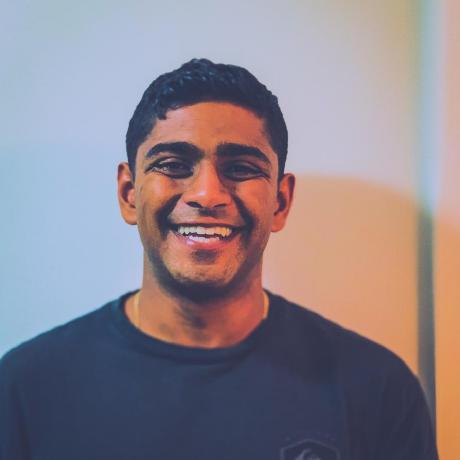

## Research Interests

I currently study deep ocean circulation in the North Atlantic Program as a PhD student under the Overturning in the Subpolar North Atlantic Program (OSNAP). My research examines abyssal flows across a wide range of physical and temporal scales to understand how flow varies in strength, position, and its hydrographic properties.

## Experience

## Publications

1. M. Devana, W.E. Johns: Rapid Freshening of Iceland Scotland Overflow Water Driven by Entrainment of a Major Upper Ocean Salinity Anomaly
<!-- 2. S.Holmes, J.Watson: Consequences of living with a sociopath in London -->

## Education

## Technical Skills

## Professional Development

This is a [link](http://google.com). Something _italics_ and something **bold**.

Here is a table

| Year | Award     | Category                                              |
| ---- | --------- | ----------------------------------------------------- |
| 2014 | Emmy      | Won Outstanding Lead Actor in a miniseries or a movie |
| 2015 | BAFTA     | Nominated for Best Leading Actor for Sherlock         |
| 2014 | Satellite | Won Best Actor miniseries or television film          |

Here is a horizontal rule

---

Here is a blockquote

> To a great mind, nothing is little

## References

- Foo Bar: Head of Department, Placeholder Names, Lorem
- John Doe: Associate Professor, Department of Computer Science, Ipsum
